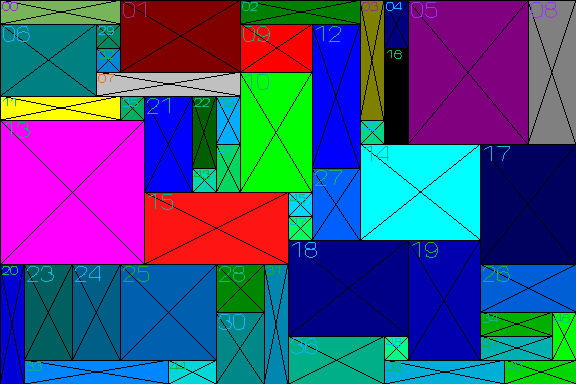
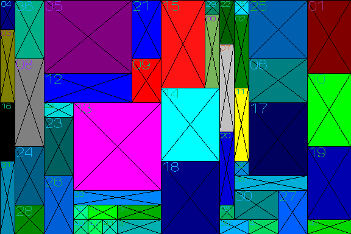
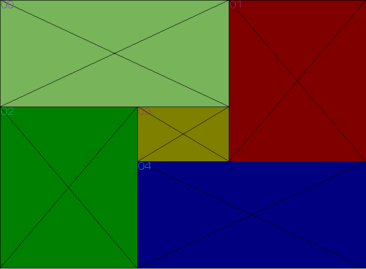
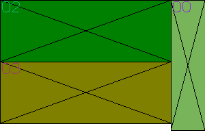
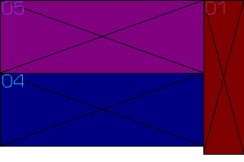

# Knack-pack rectangles

This project solves knack-pack problem with given rectangles set and
given rectangle container

## Task description

Here we have simplified knack-pack problem case with placing
rectangular elements into rectangular container.
Input: All elements (rectangles) with integer size (width, height)
and rectangular container size (width, height)
It can be unlimited number of containers with given size.
The goal to place given rectangles set into minimum number of containers.
Each rectangle can be rotated before placement.
In another words, create the densest rectangles distribution inside
minimum number of containers.
Output: print each rectangle coordinates in each container
and 2d render of final distribution

### Algorithm to solve

Here greedy algorithm is applied with significant performance optimization,
using "floating horizon" array to minimize rectangle intersections checks.

### Code description

Main function runs several tests. In the future special unit-tests can be separated
from the main project

#### Test with random generated 49 rectangles in a single container


in the function testGen() 49 rectangles are generated in the container. They looks like:


Algoritm will create dense distribution of this set with following result:


You can notice that some original rectangles are rotated in the result placement

#### Test with 5 rectangls inside single container

In the function testSingle5Rects() 5 rectangles should be placed into sinle container:


#### Test with 6 rectangles inside 2 containers

In the function testTwoBins() 6 rectangles should be arranged inside 2 containers:




## Implementation notes

Code requirements:
1. This implementation should be absolutely independant from third-party sources.
2. All code is written with c++ 11 language. 
3. Project can be run in both Windows and Linux platforms.

## Build project with MS Visual Studio

Ensure CMake is installed on your computer.
Perform following steps:
```
mkdir cmake_build
cd cmake_build
cmake ..
```

Open solution file knackpack-rect.sln in MS Visual Studio


## Run clang-tidy (strong c++ syntax)


Ensure that LLVM (with clag-tidy) is installed on your computer.
Run
```
clang-tidy src/*.cpp
```
from the project root folder

## References

Here you can find some interesting articles, related to this task:
- [Rectangle packing in wiki](https://en.wikipedia.org/wiki/Rectangle_packing)
- [Rectangle packing algorithms](https://leenderthofste.com/assets/pdf/Rectangle_Packing_Algorithms.pdf)
- [A Survey on heuristics for the two-dimensional rectangular strip packing problem ](https://www.scielo.br/j/pope/a/YBQdrp5JPBR9LswMWFWJdLB/?lang=en)
- [Rectangle packing](https://eatplayhate.me/2013/09/17/adventures-in-engine-construction-rectangle-packing/)

## Project further improvement

Here, some valuable steps are described. You can treat this like TODO steps.
Release version of this algorithm performed placement for 49 test rectangles
during 0.32 seconds (intel i7 processor) with 2500 iterations.
1) Add more tests with 50-100 rectangles
2) Create more effective (in terms of iterations number) algorithm
3) Create more tricky balance between "greedy" and "random" selection of the next rectangle candidate
